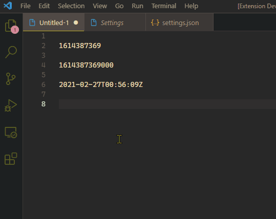

# Date Hover Preview

## Features

Hover over a string in any document that represents a date, and get a small preview that converts that date to a configurable set of timezones and formats.

Hoverable formats currently include:

* [Unix Time](https://en.wikipedia.org/wiki/Unix_time) (9-10 digits as seconds/11-14 digits as milliseconds)
* [ISO 8601](https://en.wikipedia.org/wiki/ISO_8601)

## Extension Settings

* `date-hover-preview.detect.ISO-8601String`: Whether to detect [ISO-8601](https://en.wikipedia.org/wiki/ISO_8601) format date string when hovering.
* `date-hover-preview.detect.unixTime`: Whether to detect Unix epoch time when hovering. Currently supports 9-10 digits (as seconds) or up to 14 digits (as milliseconds).
* `date-hover-preview.primaryPreview.enable`: Show primary date preview.
* `date-hover-preview.primaryPreview.name`: Show as the name of primary preview section.
* `date-hover-preview.primaryPreview.format`: Primary date preview format, described in [day.js format documentation](https://day.js.org/docs/en/display/format). Leave empty to use ISO-8601 format. See below for a quick reference.
* `date-hover-preview.primaryPreview.utcOffset`: UTC offset for the primary preview expressed as a number of hours between -16 and 16 (any number outside of that range will be interpreted as minutes).
* `date-hover-preview.primaryPreview.timezone`: Timezone for the primary preview. Timezones are expressed like \"PST\" or \"America/Los_Angeles\". This setting will take precedence over `date-hover-preview.primaryPreview.utcOffset`. If both are left blank this will use your local timezone. For a list of timezones, see the [TZ database name column](https://en.wikipedia.org/wiki/List_of_tz_database_time_zones).
* `date-hover-preview.additionalPreviews`: An array of additional preview items.
* `date-hover-preview.additionalPreviews[].name`: Show as the name of this additional preview.
* `date-hover-preview.additionalPreviews[].format`: Used to format preview display. Leave empty to use ISO-8601 format.
* `date-hover-preview.additionalPreviews[].utcOffset`: UTC offset expressed as a number of hours between -16 and 16 (any number outside of that range will be interpreted as minutes).
* `date-hover-preview.additionalPreviews[].timezone`: Timezones are expressed like \"PST\" or \"America/Los_Angeles\". This setting will take precedence over utcOffset. If both are left blank this will use your local timezone.

### Format Quick Reference

| Format | Output           | Description                           |
| ------ | ---------------- | ------------------------------------- |
| `YY`   | 18               | Two-digit year                        |
| `YYYY` | 2018             | Four-digit year                       |
| `M`    | 1-12             | The month, beginning at 1             |
| `MM`   | 01-12            | The month, 2-digits                   |
| `MMM`  | Jan-Dec          | The abbreviated month name            |
| `MMMM` | January-December | The full month name                   |
| `D`    | 1-31             | The day of the month                  |
| `DD`   | 01-31            | The day of the month, 2-digits        |
| `d`    | 0-6              | The day of the week, with Sunday as 0 |
| `dd`   | Su-Sa            | The min name of the day of the week   |
| `ddd`  | Sun-Sat          | The short name of the day of the week |
| `dddd` | Sunday-Saturday  | The name of the day of the week       |
| `H`    | 0-23             | The hour                              |
| `HH`   | 00-23            | The hour, 2-digits                    |
| `h`    | 1-12             | The hour, 12-hour clock               |
| `hh`   | 01-12            | The hour, 12-hour clock, 2-digits     |
| `m`    | 0-59             | The minute                            |
| `mm`   | 00-59            | The minute, 2-digits                  |
| `s`    | 0-59             | The second                            |
| `ss`   | 00-59            | The second, 2-digits                  |
| `SSS`  | 000-999          | The millisecond, 3-digits             |
| `Z`    | +05:00           | The offset from UTC, ±HH:mm           |
| `ZZ`   | +0500            | The offset from UTC, ±HHmm            |
| `A`    | AM PM            |                                       |
| `a`    | am pm            |                                       |

## Upcoming Features

Customizable detection formats

## Known Issues

## Release Notes

### 1.0.1

Initial release
